# Reference Benchmark Analysis: Premier Himalayan Artisanal E-Commerce Platform

---

## 1. Executive Summary & Brand Aesthetic Philosophy

This document provides a comprehensive structural, visual, functional, and user-experience breakdown of the reference benchmark platform—a premier direct-to-consumer e-commerce marketplace specializing in 100% natural, chemical-free foods, wellness botanicals, and high-altitude artisanal produce harvested across the greater Himalayan range.

### 1.1 Core Aesthetic Character
* **Visual Identity:** Earthy, organic, refined alpine heritage with contemporary editorial typography. It bridges the gap between raw, untouched mountain nature and laboratory-verified luxury wellness.
* **Tonal Palette:** Dominated by warm oatmeals (`#faf3e8`), terracotta clays (`#ba5d37`, `#c0503b`), warm cream card backgrounds (`#fdeedc`), deep forest charcoals (`#222222`), muted forest greens, and sunlit amber accents.
* **Atmospheric Imagery:** High-contrast natural sunlight, rustic weathered textures (slate slabs, untreated pine wood, raw jute, hammered brass, terracotta clay), unposed mountain harvesters, and macro botanical close-ups showcasing vibrant natural pigments.
* **Key Positioning:** **"Source-to-Shelf / Farm-to-Table Transparency"**—eliminating industrial middlemen, celebrating indigenous foraging communities, and publishing third-party laboratory purity certificates.

---

## 2. Global Design System & Component Library

### 2.1 Color Palette & Surface Tokens
| Role | Color Hex / Description | Usage Context |
| :--- | :--- | :--- |
| **Primary Base (Canvas)** | `#FAF3E8` (Warm Oatmeal Cream) | Full page background, category section wrapper, FAQ container |
| **Secondary Accent** | `#BA5D37` (Terracotta / Burnt Sienna) | Primary headings, active tab pills, scrollbar thumbs, key highlights |
| **Warm Accent** | `#C0503B` (Mountain Clay / Rust Coral) | Subheadings, card titles, sale tags, badge borders |
| **Surface Elevation** | `#FDEEDC` (Soft Peach / Bisque) | Category cards, product feature containers, hover surfaces |
| **Border / Divider** | `#E5D9C8` (Warm Sand Grey) | Section separators, grid dividers, scrollbar tracks |
| **Deep Text** | `#1C1917` / `#222222` (Charcoal Slate) | Primary body copy, product titles, policy text |
| **Muted Copy** | `#78716C` (Muted Earth Grey) | Metadata, read times, review counts, secondary notes |
| **Trust Badges** | `#2E7D32` (Forest Green) & `#D97706` (Amber) | Purity certifications, lab verified labels, discount percentages |

### 2.2 Typography Hierarchy
* **Primary Display / Headings:** Elegant editorial serif with soft humanist terminals. Conveys artisanal antiquity, literary heritage, and geographical authority.
* **Secondary / Navigation / Buttons:** Clean modern grotesque sans-serif (Inter/Outfit style) with loose letter-spacing (uppercase tracked for navigational tags, badge pills, and buttons).
* **Body & Long-form Narrative:** Highly legible humanist sans-serif with generous line-height (`1.6`–`1.8`) to ensure effortless reading across scientific descriptions and terroir profiles.

### 2.3 Component Micro-Interactions
* **Elevation & Hover:** Cards use gentle `transform: translateY(-4px)` with softened multi-layered drop shadows (`box-shadow: 0 10px 25px -5px rgba(0, 0, 0, 0.08)`).
* **Secondary Product Swaps:** Hovering over product cards immediately fades in a secondary lifestyle image showing raw ingredients in usage or packaging reverse side.
* **Badge Pills:** Subtle pill-shaped labels with micro-borders indicating distinct product tiers:
  * *Power* (High-altitude adaptogens like Shilajit)
  * *Luxury* (Lab-certified Mongra Saffron filaments)
  * *Fresh* (Direct-pressed juices and squashes)
  * *Premium* (Single-origin Badri A2 cow ghee)
  * *Sale* (Discount percentage flags with high-visibility contrast)

---

## 3. Section-by-Section Structural Breakdown

```mermaid
graph TD
    A[1. Multi-Message Safety & Operational Announcement Ticker] --> B[2. Sticky Navigation Header with Deep Taxonomy]
    B --> C[3. Full-Bleed Cinematic Hero Slideshow Carousel]
    C --> D[4. Curated Circular Category Navigation Track]
    D --> E[5. Fastest-Selling High-Velocity Product Carousel]
    E --> F[6. First-Time Discovery Onboarding Module: Start Here]
    F --> G[7. Regional Terroir & Provenance Insignia Grid]
    G --> H[8. Artisanal Guild & Brand Showcase: Shop by Brand]
    H --> I[9. Tabbed Curated Collections & Featured Categories]
    I --> J[10. This Season Botanical Spotlight Showcase]
    J --> K[11. Social Impact Metric & Omnichannel Retail Bar]
    K --> L[12. Verified Customer Testimonials Carousel]
    L --> M[13. Brand Origin Philosophy Narrative Billboard]
    M --> N[14. Four-Pillar Value Proposition Grid: Why Us?]
    N --> O[15. In The Press Editorial Feature Bar]
    O --> P[16. Academic & Government Institutional Accreditations]
    P --> Q[17. Brand Transparency Comparison Matrix]
    Q --> R[18. Accordion Knowledge Base & Trust FAQ]
    R --> S[19. Educational Editorial Journal: Latest Articles]
    S --> T[20. Comprehensive 4-Column Footer Architecture]
```



---

### Section 1: Multi-Message Safety & Operational Announcement Ticker
* **Layout:** Top-of-page fixed slim ribbon with horizontal continuous carousel/ticker.
* **Content:**
  * Logistics updates (holiday shipping notices, order dispatch timelines).
  * Consumer fraud alerts & official security validation (strict warning stating representatives will never call to request private UPI/bank payments; official telephone numbers explicitly published).
  * Global international shipping call-to-action banner with quick redirection.
* **UX Function:** Establishes immediate operational integrity, logistical transparency, and protects customer trust against online scams.

---

### Section 2: Sticky Navigation Header with Deep Categorized Mega-Menu
* **Layout:** Clean white/off-white sticky navigation bar with subtle lower border.
  * *Left:* Minimalist logo incorporating mountain silhouettes and clean modern lettering.
  * *Center:* Multi-tier categorization:
    1. **Best Sellers:** Instant links to flagship staples (Seabuckthorn Pulp, Ladakhi Shilajit, Kashmiri Saffron, Sun-dried Fruits, Cold-climate Orchard Produce).
    2. **Shop by Category:** Comprehensive drop-down covering 15+ specialized niches (A2 Cow Ghee, Savory Dips & Sauces, Mountain Mushrooms, High-altitude Grains & Pulses, Hemp Naturals, Shilajit, Fruit Spreads & Preserves, Cold-pressed Juices & Squashes, Raw Wild Honey, Herbal Teas, Indigenous Spices & Herbs, High-grown Coffee).
    3. **Shop by Region:** Direct gateways to 10 distinct geographic zones.
    4. **Curated Collections:** Tailored wellness journeys (Pure Seabuckthorn, Mountain Wellness, Desi Ghee, Pure Beverages, Dry Fruits, Whole Spices, Cold-pressed Oils).
    5. **Brand Narrative & Utility:** Seasonal Sales, Editorial Journal, Origin Story, International Dispatch, Live Tracking, Physical Experience Centers.
  * *Right:* Real-time search popup trigger, persistent wishlist counter, and slide-out quick cart drawer icon with dynamic counter.

---

### Section 3: Full-Bleed Cinematic Hero Slideshow Carousel
* **Layout:** Full-width responsive hero slider (desktop 3840px master dimension, optimized mobile vertical view) with auto-play interval, subtle arrow navigation, and indicator dots.
* **Image Breakdown & Art Direction:**
  * **Hero Slide 1 (Wild High-Altitude Botanical Harvest):**
    * *Subject:* Expansive panoramic landscape of high-altitude Himalayan valleys bathed in warm dawn mist, accompanied by close-up wooden bowls of ripe, golden-orange berries and crystalline raw botanicals.
    * *Lighting & Tone:* Golden-hour ambient warmth contrasting against cold snow-dusted slate peaks.
    * *Copy Overlay:* Editorial serif headline celebrating untouched purity, accompanied by an earthy CTA button ("Explore Harvest").
  * **Hero Slide 2 (Ancient Mountain Adaptogen Vitality):**
    * *Subject:* Dramatic close-up of dark mineral-rich resin collected from rugged rock fissures, framed alongside amber glassware and fresh mountain spring water.
    * *Style:* Deep, grounding chiaroscuro lighting accentuating raw, mineral authenticity.
  * **Hero Slide 3 (Small-Batch Orchard & Kitchen Preserves):**
    * *Subject:* Sunlit rustic table setting with glass carafes of vibrant crimson and golden-yellow fruit concentrates, accompanied by freshly sliced wild fruits, mint leaves, and mountain wildflower honeycombs.
    * *Style:* Warm domestic warmth, artisanal kitchen authenticity, no artificial synthetic coloring.
  * **Hero Slide 4 (Curated Mountain Heritage Gifting):**
    * *Subject:* Handcrafted wooden and matte-card gift hampers filled with glass jars of saffron, golden honey, and hand-selected nuts, tied with natural jute twine.
    * *Style:* Premium festive gifting, understated luxury, sustainable plastic-free presentation.

---

### Section 4: Curated Category Navigation Carousel ("Shop By Category")
* **Layout:** Horizontal scroll track with left/right circular arrow buttons. 5 cards visible on desktop, 2 on mobile.
* **Card Design:** Circular / curved square elevated containers with subtle pastel backgrounds (`#fdeedc`), bordered in soft earth tones.
* **Categories Featured:**
  1. *Artisanal Gifting:* Curated festive gift boxes and wooden hampers.
  2. *Sea Buckthorn:* Bright orange cold-desert berries and derivative formulations.
  3. *Natural Beverages:* Small-batch squashes, fruit coolers, and floral cordials.
  4. *Jams & Fruit Preserves:* Whole-fruit low-sugar spreads made from wild mountain berries and stone fruits.
  5. *Sun-Dried Fruits & Nuts:* Single-tree almonds, snow-white walnut halves, and sun-cured apricots.
  6. *Raw Mountain Honey:* Pure single-floral honeys harvested from wild hives (White honey, Rock bee, Melipona stingless bee).
  7. *Pure Desi Ghee:* Traditional bilona method A2 Badri cow clarified butter.
  8. *Native Spices & Herbs:* Hand-ground stone-mill salts, high-curcumin turmeric, and uncompounded resins.

---

### Section 5: "Fastest-Selling" High-Velocity Product Carousel
* **Layout:** High-density horizontal product slider with interactive navigation buttons.
* **Product Card Anatomy:**
  * Aspect ratio: 1:1 square image preview.
  * Top-left: High-contrast discount pill badge (`SAVE 13%`, `SAVE 19%`, `SAVE 33%`).
  * Top-right: Interactive wishlist heart icon.
  * Image: Studio-grade packshot on organic off-white or natural wood surface; secondary hover shows liquid pouring, bottle reverse, or raw ingredient texture.
  * Title: Detailed, descriptive naming including active botanical properties and volume (e.g. *Seabuckthorn Pulp - Rich in Omega 3,6,7,9 & Vitamin C - 300ml*).
  * Rating & Social Proof: 5-star rating stars with hyperlinked review counts (e.g., *1,995 Reviews*).
  * Price Display: Bold current discounted price paired with strikethrough original MRP.
  * CTA: Direct "Add to Cart" button with instant drawer feedback.

---

### Section 6: First-Time Discovery Onboarding Module ("Start Here")
* **Layout:** Dedicated curated rail highlighting the platform's top 7 highest-trust entry products for newcomers.
* **Selection Strategy:** Designed to overcome skepticism by showcasing verified lab-tested flagship items:
  1. Pure Sea Buckthorn Pulp (Vitamin C & Omega-7 powerhouse).
  2. Buransh (Rhododendron) Sanjivni Flower Squash (Traditional heart & cooling tonic).
  3. Lab-Certified Mongra Kashmiri Saffron (Tested by independent accredited labs for Grade-1 purity).
  4. Single-Tree Kashmiri Walnuts & Almonds (Intact natural oils, unbleached shells).
  5. Whole Sun-Dried Sea Buckthorn Berries (Snacking adaptogen).
  6. Afghani Pahadi Hing Crystal Resin (Raw uncompounded crystal lump with intense aroma).
  7. Supercritical CO₂ Extracted Sea Buckthorn Seed & Berry Oil.

---

### Section 7: Regional Terroir & Geographic Origin Provenance Insignia Grid
*(Addressing the specialized regional classification system without using the forbidden terminology)*

* **Strategic Purpose:** The platform categorizes its catalog not merely by generic ingredient types, but by specific micro-climates, soil compositions, and indigenous ancestral traditions. This is represented visually through a dedicated, interactive set of **Geographic Origin Provenance Insignia**.
* **Visual Construction & Architecture:**
  * **Card Silhouette & Proportion:** Upright vertical rectangular plaques (~0.85 aspect ratio, approx 170px width) evoking official historical origin markers, archival certification plaques, and botanical heritage seals.
  * **Framing & Perimeter Treatment:** Decorated with a distinctive micro-notched or delicately scalloped perimeter frame reminiscent of archival collectors' cards and official regional tax/certification seals. This gives each card a physical, tactile impression of an authentic validation document issued by the local mountain enclave.
  * **Internal Artwork:** Archival-toned photographic vignettes capturing iconic geographic landforms, endemic flora, and mountain architectures representative of each region:
    * High-contrast mountain ridge silhouettes.
    * Traditional wooden village verandas and terraced stone slopes.
    * Alpine river canyons and misty high-altitude valleys.
  * **Typographic Anchoring:** Clean, high-legibility serif region titles anchored directly below the graphic plaque, paired with elevation indicators and provenance notes.
  * **Interactive Response:** Smooth vertical lift (`translateY(-6px)`) with expanding ambient shadow on hover, reinforcing the sensory tactile appeal of an authentic certification artifact.

#### The 10 Recognized Geographic Enclaves:
| Geographic Enclave | Terroir & Microclimate Profile | Signature Flora & Harvest Specialties |
| :--- | :--- | :--- |
| **1. Ladakh** | High-altitude Trans-Himalayan cold desert (11,000+ ft), intense solar radiation, extreme diurnal thermal shifts. | Wild Sea Buckthorn (Tsestalulu), Raktse Karpo sweet apricots, high-mineral purified Shilajit resin. |
| **2. Kashmir** | Fertile alluvial Karewa plateaus, temperate alpine climate fed by glacial streams. | Mongra Grade-1 Saffron (crocin-rich), paper-shell Kagzi walnuts, single-tree badam. |
| **3. Himachal Pradesh** | High alpine river valleys (Kinnaur, Kullu, Spiti), sub-zero winters, mineral-rich soil. | Wild apple cider vinegar, high-altitude Kinnauri red rajma, black cumin (Kala Jeera), chilgoza pine nuts. |
| **4. Uttarakhand** | Sacred Garhwal & Kumaon high-meadows, dense oak and rhododendron forests. | Wild Buransh (Rhododendron) flowers, A2 Badri cow bilona ghee, Jakhiya herb, traditional Sil-Batta ground salts. |
| **5. Sikkim** | Fully certified 100% organic alpine state, high precipitation, cloud-forest slopes under Kanchenjunga. | Black cardamom (Badi Elaichi), fermented bamboo shoot preserves, organic buckwheat. |
| **6. Meghalaya** | Mist-clad sub-tropical karst hills (Jaintia Hills) with rainfall-fed acidic soil. | Lakadong Turmeric (record-breaking 8%–10% natural curcumin content), Ing Makhir ginger (potent gingerol). |
| **7. Nagaland** | Pristine Eastern Himalayan biodiversity corridors, ancestral shifting terrace farming. | Wild forest rock bee honey, volcanic stone-ground Bird's Eye chillies, smoked mountain peppers. |
| **8. Bhutan** | Carbon-negative Himalayan kingdom, virgin sub-alpine ecosystems. | Cordyceps militaris, highland herbal wellness tisanes, rare wild berry concentrates. |
| **9. Western Ghats** | Ancient UNESCO biodiversity hotspot, humid evergreen mountain slopes. | Forest borage honey, single-estate green and black whole peppercorns, virgin coconut elixirs. |
| **10. Darjeeling** | Steep mist-covered ridges, morning fog, high UV exposure, mineral shale soils. | Heritage spring-flush whole leaf teas, single-estate bio-dynamic flushes, wild mountain thyme. |

---

### Section 8: Artisanal Guild & Brand Partner Showcase ("Shop By Brand")
* **Layout:** 3-column card grid highlighting independent mountain cooperatives, women self-help collectives, and family-owned processing units.
* **Card Anatomy:**
  * *Top Media Box:* Large editorial lifestyle photograph showing authentic on-site production (e.g. traditional wooden churn bilona process, open-air sun-drying of stone fruits on mountain rooftops, copper vessel flower simmering).
  * *Bottom Floating Card:* Overlapping pill badge with the artisan collective's circular logo, product quantity counter (e.g., *"52 Products"*, *"36 Products"*), and a high-contrast button (*"Shop Now"*).
* **Strategic Intent:** Reinforces that the platform is an empowering marketplace for grass-roots mountain creators rather than a faceless industrialized aggregator.

---

### Section 9: Tabbed Curated Collections & Featured Categories
* **Layout:** Centralized interactive tab navigation bar with pill buttons switching between dynamic carousels without page reloads.
* **Interactive Tabs:**
  1. *Pure Seabuckthorn* (Juices, oils, teas, dried whole berries, pulp concentrates).
  2. *Pahadi Wellness* (Shilajit, Ashwagandha root, Moringa powder, Reishi, Lion's Mane, Chaga mushroom chunks).
  3. *Pahadi Ghee* (Cultured bilona Badri cow ghee in heavy glass jars).
  4. *Natural Beverages* (Unrefined fruit squashes, floral coolers, cider vinegars).
  5. *Dry Fruits* (Wild apricots, walnut halves, apricot kernels, super-trail mixes).
  6. *Pure Spices* (Lakadong turmeric, hand-pounded bird's eye chilli, artisanal sil-batta herb salts).
  7. *Pure Oils* (Supercritical CO₂ sea buckthorn oil, apricot kernel cold-pressed oil, high-altitude lavender essential oil).

---

### Section 10: "This Season Spotlight" Botanical Ingredient Showcase
* **Layout:** An organic mosaic showcasing six essential raw ingredients in their natural botanical form.
* **Image Breakdown:**
  1. **Saffron:** Macro shot of vibrant deep-crimson stigmas resting on handmade cotton rag paper, illuminated by warm natural light.
  2. **Chamomile:** Whole dried sun-cured white petals and golden disc florets spilling over a rustic slate platter.
  3. **Shilajit:** Glossy, viscous pitch-black resin dripping from a mountain stone flake, highlighting mineral density and high fulvic acid purity.
  4. **Lavender:** Freshly clipped violet floral spikes with dew droplets alongside dark amber distillation dropper bottles.
  5. **Sea Buckthorn:** Wild branches covered in golden-orange spheroids surrounded by silvery-green thorny leaves against snow.
  6. **Wild Honey:** Viscous amber liquid cascading from a wooden honey dipper into a clear hexagonal jar, catching backlit sun rays.

---

### Section 11: Social Impact & Omnichannel Retail Banner
* **Layout:** Full-width terracotta/warm clay textured horizontal billboard.
* **Key Metrics & Content:**
  * **Social Metric:** *"More than 10 Lakh products sold, and just as many lives impacted"*
  * **Social Proof Counter:** *"More than 1,00,000 5-Star Reviews"*
  * **Omnichannel Availability Badges:** High-contrast clean white partner logos for multi-channel purchase verification:
    * *Amazon*
    * *Flipkart*
    * *Blinkit (Quick-commerce partner)*
* **Psychological Impact:** Instantly validates fulfillment scale, logistics dependability, and nationwide mainstream acceptance.

---

### Section 12: Verified Customer Testimonials Carousel
* **Layout:** Multi-card testimonial swiper featuring authentic reviews linked to specific verified purchases.
* **Card Structure:**
  * Prominent quotation headline (e.g., *"Love it"*, *"Great Products"*, *"Awesome"*, *"My fav Store"*).
  * In-depth narrative discussing tangible health benefits (energy surges from Shilajit, enhanced sleep from mushroom blends, gut vitality from raw fruit cordials).
  * Reviewer badge: Initial avatar, customer first name, and green **"Verified buyer"** badge.
  * Product Thumbnail: Micro 80x80 thumbnail and hyperlinked title of the exact verified product purchased.

---

### Section 13: Brand Origin Philosophy Narrative Billboard
* **Layout:** Full-width cinematic split layout combining an atmospheric photographic backdrop with an editorial text block.
* **Image Breakdown:**
  * *Visual Subject:* Mist-covered Himalayan ridgeline during early dawn with silhouetted mountain women carrying traditional wicker baskets along narrow alpine paths.
  * *Tone:* Soulful, respectful, unvarnished—capturing the harsh yet sacred beauty of mountain subsistence farming.
* **Copy Narrative:**
  * **Headline:** *"The Philosophy rooted in the Mountains"*
  * **Sub-headline:** *"We are building the world's first source-to-table Premium Himalayan brand that makes high-quality and authentic Himalayan produce accessible to all."*
  * **Action Button:** Editorial outlined pill button reading *"ABOUT US"*.

---

### Section 14: Four-Pillar Value Proposition Grid ("Why Us?")
* **Layout:** 4-column desktop responsive grid (2x2 on tablet/mobile) with minimalist bespoke line-art icons on cream backgrounds.
* **The 4 Core Pillars:**
  1. **Pure:**
     * *Icon:* Dual alpine mountain peaks in fine line weight.
     * *Copy:* *"Sourced from the Himalayas, unadulterated and untouched — the way nature intended."*
  2. **Authentic:**
     * *Icon:* Mountain farmer silhouette with traditional sickle / harvest basket.
     * *Copy:* *"We bring you what the locals use — no shortcuts, no factory imitations."*
  3. **Transparency:**
     * *Icon:* Delicate translucent botanical leaf with open magnifying lens.
     * *Copy:* *"From source to shelf, we show you everything — because trust isn’t built on secrets."*
  4. **Lab Tested:**
     * *Icon:* Scientific Erlenmeyer flask intertwined with a mountain blossom.
     * *Copy:* *"Every batch goes through rigorous testing — purity you can verify, not just believe."*

---

### Section 15: Media Authority & Press Recognition ("In The Press")
* **Layout:** Clean monochrome media logo showcase featuring prominent national newspapers and business publications.
* **Media Features:**
  * **The Hindu:** *"Brings Authentic Himalayan Flavours to Festive Celebrations"* (2 min read).
  * **Entrepreneur India:** *"Secures Funding to Scale Himalayan Wellness Offerings"* (2 min read).
  * **Outlook:** *"Meet the Next-Gen Apple Sellers of Himachal Pradesh Thriving in the Digital Marketplace"* (2 min read).
  * **Homegrown:** *"Empowering Himalayan Businesses Through E-Commerce"* (2 min read).
  * **Zee Business Hindi:** *"How This Startup Is Helping Himalayan Farmers"* (2 min read).

---

### Section 16: Institutional & Government Backing ("Supported By")
* **Layout:** High-credibility validation section displaying official government ministry emblems and premier academic institute incubation logos.
* **Entities Displayed:**
  * **MeitY (Ministry of Electronics and Information Technology, Government of India):** National technological incubation support.
  * **Ministry of Agriculture & Farmers Welfare, Government of India:** ODOP (One District One Product) cooperative alignment.
  * **IIT Mandi Catalyst:** Premier technological research and incubator accelerator backing.
  * **IIM Kashipur:** Premier management institute business mentorship and supply-chain incubation.
  * **OYO:** Strategic hospitality retail partnership and early-stage startup enablement.

---

### Section 17: Purity & Transparency Comparison Matrix ("Why Choose Us?")
* **Layout:** Direct comparative table contrasting the platform's uncompromising standards against conventional commercial marketplace alternatives.
* **Comparative Criteria:**
  | Evaluation Parameter | Platform Standard | Conventional Market Competitors |
  | :--- | :---: | :---: |
  | **Sourced direct from farmers** | **YES** *(Direct SHGs & cooperatives)* | NO *(Multi-tier middleman brokers)* |
  | **Traceable to the specific batch** | **YES** *(Batch-level QR/origin data)* | NO *(Aggregated bulk commodities)* |
  | **Published third-party lab reports** | **YES** *(Independent FARE Labs / FSSAI)* | NO *(Unverified marketing claims)* |
  | **Screened for heavy metals & adulterants** | **YES** *(Mandatory pre-release screen)* | NO *(Infrequent or post-complaint checks)* |
  | **Fair price paid directly to grower** | **YES** *(Direct ethical compensation)* | NO *(Low farm-gate pricing)* |

---

### Section 18: Knowledge Base & Trust FAQ Accordion ("Things People Ask Us")
* **Layout:** Clean, interactive expandable accordion cards with smooth height transition animations.
* **Key FAQ Topics & Content:**
  * *Authenticity of Himalayan Sourcing:* Explains direct sourcing across 9 Himalayan states and Bhutan with zero intermediate consolidators.
  * *Verification Protocols:* Details active compound quantification, solvent screening, and microbiological testing.
  * *Kashmiri Saffron vs. Commercial Imitations:* Educates consumers on how cheap saffron is adulterated with dyed gardenia or corn silk; explains accredited ISO lab verification.
  * *Ladakhi Shilajit Harvesting:* Explains the difference between high-altitude rock harvest purification vs. cheap solvent-extracted powders.
  * *Heavy Metal Contamination in Resins & Ghee:* Outlines strict pre-batch lab release protocols specifically for dense resins and dairy fats.
  * *Support for Women Harvesters & Mountain Farmers:* Details fair-trade pricing models and ODOP alignment.

---

### Section 19: Educational Editorial Journal ("Latest Articles")
* **Layout:** 4-column article card layout with rich editorial photography, publication dates, and reading duration tags.
* **Featured Articles & Imagery:**
  1. *How to Use Pure Hing Crystals Without Overpowering Your Food:*
     * *Image:* Close-up of raw crystalline resin being crushed with a brass pestle, next to hot clarified ghee and spices in a cast-iron pan.
  2. *Shilajit Price in India: How to Compare Quality Before You Buy:*
     * *Image:* Laboratory dropper testing black resin solubility in warm spring water, demonstrating complete sediment-free dissolution.
  3. *Buy Shilajit Online: What to Check Before Choosing a Product:*
     * *Image:* High-altitude rocky mountain crags in Ladakh with mineral veins, paired with authentic certificate readouts.
  4. *7 Benefits of Spiti Sea Buckthorn You Should Know:*
     * *Image:* Vibrant orange sea buckthorn berries frosted with mountain snow, showing intense natural pigmentation.

---

### Section 20: Comprehensive 4-Column Footer Architecture
* **Column 1: Quick Selects:** Direct links to top high-volume essentials (Seabuckthorn Pulp, Ladakhi Shilajit, Kashmiri Saffron, Sun-dried Fruits, Raw Mountain Honey).
* **Column 2: Corporate & Policies:** Privacy Policy, Shipping Guidelines, Cancellation & Refund Policies, Terms of Service, Legal Compliance.
* **Column 3: Regulatory & Customer Redressal:** Transparent disclosure of designated Grievance Redressal Officer with physical name, official email, and phone contact details.
* **Column 4: Community Engagement & Newsletter:** Email subscription field with promise of seasonal harvest dispatches and exclusive member allocations.
* **Bottom Trust Bar:**
  * Official **FSSAI Certified** logo emblem.
  * Copyright notice and sustainable packaging commitment.
  * Mobile Sticky Bar: Quick navigation buttons for Home, Cart (with live badge), and 1-click WhatsApp customer support concierge.

---

## 4. In-Depth Image & Banner Art Direction Taxonomy

To achieve the benchmark's visual gravitas, the platform employs strict photography standards across all digital assets:

```
+---------------------------------------------------------------------------------------------------------+
|                                    VISUAL ASSET CATEGORIZATION MATRIX                                   |
+---------------------------------------------------------------------------------------------------------+
| 1. Product Packshots      | 2. Raw Botanical Stills   | 3. Harvester Portrayals   | 4. Terroir Vistas   |
| - Pure textured backdrops | - Freshly clipped flora   | - Authentic mountain folk | - Dramatic alpine   |
| - Matte glass jars        | - Macro mineral crystals  | - High-altitude fields    | - Sun-drenched mist |
| - Highlighting viscous oils| - Spilling berries & nuts | - No staged models        | - Cold desert rock  |
+---------------------------------------------------------------------------------------------------------+
```

### 4.1 Product Photography Standards
* **Containers:** Heavy, pharmaceutical-grade dark amber or flint glass jars, minimalist matte paper labels, and sustainable wooden or aluminum screw caps. No cheap glossy plastic.
* **Background Textures:** Real mountain materials—dark split slate, rough river stone, hand-planed untreated pine planks, raw woven unbleached jute fabric, and handmade Lokta paper.
* **Lighting:** Single-source directional warm natural lighting mimicking morning mountain sun (approx 3800K–4200K), casting soft, authentic directional shadows.
* **Secondary Action Shots:** Liquid pouring into spring water, honey drizzling from carved dippers, resin dissolving in warm milk, whole spices snapped in half to reveal rich internal oils.

### 4.2 Harvester & Community Portraits
* **Demographic Representation:** Authentic local mountain women collectives, Ladakhi high-altitude foragers, and elderly Pahadi farmers in traditional woollen attire.
* **Expression & Poses:** Dignified, unforced, candid interaction with crops and fields; strictly avoiding generic stock photography or studio-posed models.
* **Environment:** Authentic terraced hillsides, high cold-desert plateaus, traditional slate-roofed drying verandas, and rustic wood-smoke kitchens.

### 4.3 Digital Graphic Assets & Banners
* **Color Temperature:** Grounded, earthy, autumnal and alpine tones—warm ochre, deep terracotta, forest moss green, slate grey, and mountain snow white.
* **Overlays & Typography:** Subtle 20%–30% dark gradients along edges to maintain pristine text contrast for white or ivory typography; strictly zero bright synthetic neons or flat primary colors.

---

## 5. Strategic Conversion & Trust Architecture Summary

The reference site succeeds not by aggressive discount tactics, but by systematically dismantling consumer skepticism around natural wellness products:

1. **Proof Over Claims:** Rather than merely claiming purity, every product card connects to independent laboratory test results and batch screening data.
2. **Geographic Identity (Terroir):** Products are bound to their specific mountain origins via the **Regional Origin Provenance Insignia**, elevating everyday food into cultural culinary heritage.
3. **Institutional Validation:** Dual backing from premier academic institutions (IIT, IIM) and Government Ministries (MeitY, Agriculture) transforms an artisanal brand into a nationally recognized, credible venture.
4. **Radical Transparency:** The comparative matrix, customer grievance officer disclosure, and anti-fraud payment warnings provide immediate confidence to first-time shoppers.
5. **Multi-Channel Social Proof:** Displaying partner badges (Amazon Choice, Flipkart, Blinkit) alongside 1,00,000+ customer reviews signals mainstream consumer satisfaction and dependable fulfillment.
